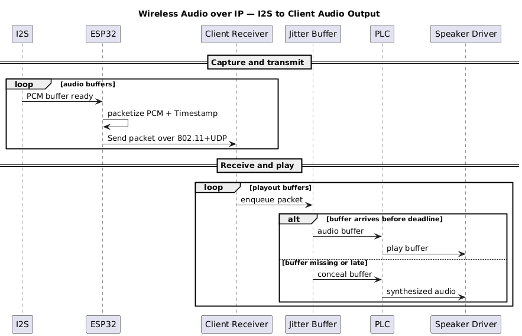

# Local Wireless Audio over IP Solution

    **Status**: { Proposed }
    
    **Updated**: {2026-02-09}

## Summary

This document lays out the design of a wireless audio over IP (802.11) solution which transmits audio (voice, guitar) wirelessly using UDP packets with the intention of consumption of a nearby device (cell phone, laptop) for realtime playback, replicating some of the functionality of traditional audio interfaces, which are wired

## Drivers

We are building this as a class assignment for CS 578 Wireless Networks

## Options

### Microcontroller

ESP32: good, industry standard solution for wireless communications. Less standard for realtime audio, but likely good enough for a class project. ESP32-C5 for 5Ghz support

### Signal Source

Guitar signal: This requires some analog work to buffer the signal and digitally convert it

Line level signal: this requires less work, as line level ADCs are common.

I2S digital microphone: this is the easiest option, but also the most limiting. Single module solution.

### Client

Client pushes audio directly to audio driver in simple client: allows the most control over packet loss concealment, jitter buffering, bounded latency.

Virtual Audio Cable: Instead of the client playing audio directly, send it over an out of box virtual audio cable solution. Allows audio to be consumed by other applications without kernel-level driver work.

Off the shelf: Use tools built into FFMpeg or VLC Media Player. Easiest solution, but we relinquish control of latency or PLC.

### Wireless options

UDP Over Wifi: No need to build a dongle (leaves the option to in the future if we want to build a usb dongle solution). Allows us to control how much loss/latency we are willing to accept through the use of a jitter buffer.

### Other Features

Basic Packet Loss Concealment (PLC): If packets don't arrive by the jitter buffer deadline, we can use PLC to hide the fact the packet never arrived. For example, single missing packet can be synthesized by averaging the packet before and after, or repeating the last valid packet. For continous loss, just fade to silence to avoid jarring clicks.

Measurement of loss/latency: Use timestamps in packets to determine average latency. Use PLC calls to determine average loss.

Band selection: Choose the least lossy/congested of 2.4/5Ghz channels. Requires both microcontroller with 5Ghz support AND implementation of loss/latency metrics.

## Options Analysis/Recommendation

## Assumptions

## Constraints

## Design/Architecture

## Sequence Diagram

